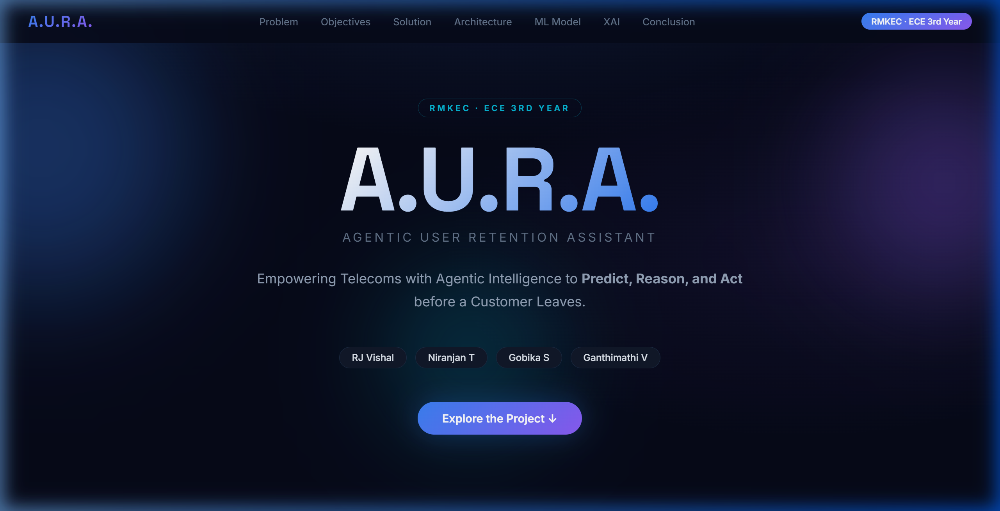
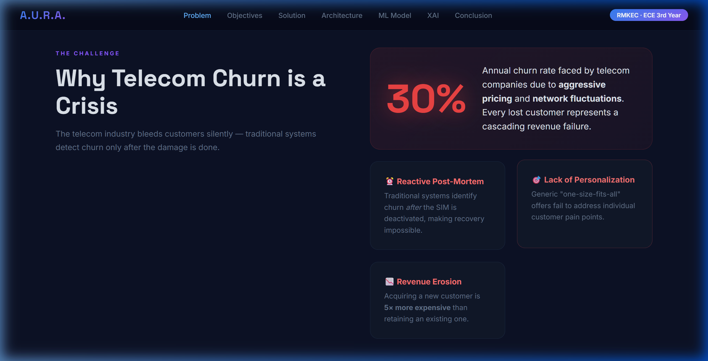
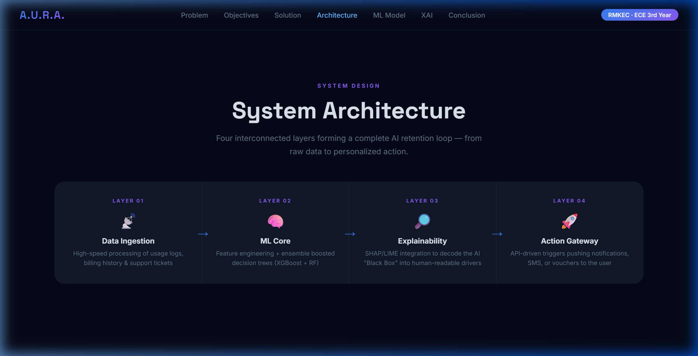
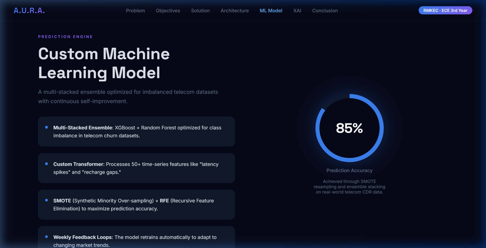
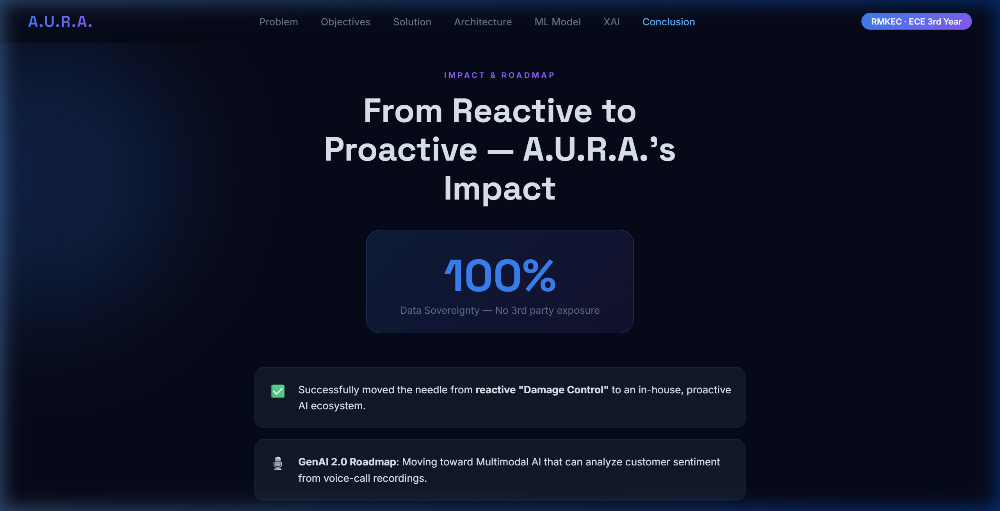

<div align="center">

# ✦ A.U.R.A.
### Agentic User Retention Assistant

**Empowering Telecoms with Agentic Intelligence to Predict, Reason, and Act before a Customer Leaves.**



[](.)
[](.)
[](.)
[](.)
[](LICENSE)

</div>

---

## 📌 Table of Contents

- [Overview](#-overview)
- [The Problem](#-the-problem)
- [Objectives](#-objectives)
- [Proposed Solution](#-proposed-solution)
- [System Architecture](#-system-architecture)
- [Dataset & Features](#-dataset--features)
- [Machine Learning Model](#-machine-learning-model)
- [Explainable AI (XAI)](#-explainable-ai-xai)
- [Retention Decision Engine](#-retention-decision-engine)
- [Domain-Specific LLM (SLM)](#-domain-specific-llm-slm)
- [Conclusion & Roadmap](#-conclusion--roadmap)
- [Team](#-team)
- [Running Locally](#-running-locally)

---

## 🌐 Overview

**A.U.R.A.** (Agentic User Retention Assistant) is an **end-to-end AI-powered churn prediction and retention platform** designed for the telecom industry.

Unlike traditional systems that act only after a customer has already left, A.U.R.A. predicts churn **30+ days in advance**, explains the reasoning behind every prediction using XAI, and automatically triggers personalized retention actions — all without human delay.

> Built as an **in-house, data-sovereign system** — sensitive customer data never leaves the secure local environment.

---

## 🔴 The Problem



| Pain Point | Description |
|---|---|
| 📉 **30% Annual Churn** | Telecom companies face massive annual churn due to aggressive pricing and network instability |
| ⏰ **Reactive Post-Mortem** | Traditional systems identify churn *after* SIM deactivation — recovery is impossible |
| 🎯 **No Personalization** | Generic "one-size-fits-all" offers fail to address individual customer pain points |
| 💸 **Revenue Erosion** | Acquiring a new customer is **5× more expensive** than retaining an existing one |

---

## 🎯 Objectives

- **Early Detection** — Predict high-risk customers at least **30 days** before they decide to leave
- **Granular Analysis** — Isolate technical (network), financial (billing), or competitive churn drivers
- **Automated Intervention** — Close the loop between data insights and marketing actions *without human delay*
- **Customer Lifetime Value** — Maximize long-term revenue by improving brand loyalty and satisfaction

---

## 💡 Proposed Solution

A.U.R.A. is not just a predictor — it's a **full prescriptive retention ecosystem**:

| Pillar | Description |
|---|---|
| 🧠 **In-House Proprietary AI** | Custom ML core + a domain-specific Small Language Model (SLM) |
| 📋 **Prescriptive Retention** | Not just *"who"* will leave — an AI strategy for *"how"* to retain them |
| 🔍 **Explainable AI (XAI)** | SHAP/LIME integration decodes every AI decision for human agents |
| 🔄 **End-to-End Pipeline** | Ingests live CDR (Call Detail Records) → outputs retention actions |

---

## 🏗️ System Architecture



```
📡 Data Ingestion  ──▶  🧠 ML Core  ──▶  🔎 Explainability  ──▶  🚀 Action Gateway
```

| Layer | Component | Role |
|---|---|---|
| **01** | Data Ingestion | High-speed processing of usage logs, billing history & support tickets |
| **02** | ML Core | Feature engineering + ensemble boosted decision trees (XGBoost + RF) |
| **03** | Explainability | SHAP/LIME decodes the AI "Black Box" into human-readable churn drivers |
| **04** | Action Gateway | API-driven triggers pushing notifications, SMS, or vouchers to the user |

---

## 📊 Dataset & Features

The model ingests **4 categories** of real-world telecom signals:

| Category | Features |
|---|---|
| 📶 **Service Quality** | Call drop rates, 5G latency, signal strength in user's primary location |
| 🧭 **Behavioral Data** | Customer support interactions, ignored plan expiry reminders |
| 🌐 **External Factors** | Competitor signal coverage, rival service pack pricing |
| 📊 **Usage Metrics** | Daily data volume, call duration, roaming frequency trends |

---

## 🤖 Machine Learning Model



A **Multi-Stacked Ensemble** architecture optimized for real-world imbalanced telecom datasets:

- **XGBoost + Random Forest** — stacked ensemble for robust prediction
- **Custom Transformer** — processes 50+ time-series features: *latency spikes, recharge gaps*
- **SMOTE** (Synthetic Minority Over-sampling Technique) to fix class imbalance
- **RFE** (Recursive Feature Elimination) to select the most predictive signals
- **Weekly Feedback Loops** — automatic retraining to adapt to market changes

```
🎯  Prediction Accuracy: 85%+
📅  Detection Window:    30 days before churn
🔁  Retraining Cadence:  Weekly
```

---

## 🔍 Explainable AI (XAI)

A.U.R.A. eliminates the AI **"Black Box"** problem entirely:

| Technique | What It Does |
|---|---|
| **Custom SHAP Integration** | Maps ML outputs into human-readable "Churn Drivers" |
| **Local Insights** | Explains *why a specific user* is at risk of leaving |
| **Global Insights** | Identifies *network-wide* failures affecting many users at once |
| **Diagnostic Transparency** | Shows exact correlation between service drops and churn risk score |
| **Reasoning Bridge** | SHAP output feeds the custom SLM for personalized message generation |

---

## ⚡ Retention Decision Engine

```
IF  Churn Reason = "Price"
THEN  Trigger = "Targeted Discount / Upgrade Offer"
```

Three automated action types based on churn driver identified:

| Action | Trigger Condition |
|---|---|
| 🛠️ **Network Recovery** | Automatic data booster provisioning for poor signal users |
| 🎮 **Loyalty Rewards** | Gamified engagement for low-usage users to increase stickiness |
| 🔄 **Feedback Loop** | Learns from offer success/failure to optimize future strategies |

---

## 🗣️ Domain-Specific LLM (SLM)

A lightweight **Small Language Model** fine-tuned exclusively on telecom data:

- **Knowledge Distillation** — compressed from larger models into an edge-deployable SLM
- **Domain Tuning** — trained on telecom plans, network terminology, and customer service logs
- **100% Data Sovereignty** — customer data never leaves the local secure environment
- **Dynamic Content Generation** — hyper-personalized SMS/Email based on individual churn reason

---

## 🏁 Conclusion & Roadmap



A.U.R.A. successfully shifts the paradigm from **reactive damage control** to a **proactive AI retention ecosystem**.

### ✅ Achieved
- End-to-end churn prediction pipeline with 85%+ accuracy
- XAI layer for full decision transparency
- Personalized retention action generation
- 100% in-house, data-sovereign architecture

### 🚀 Roadmap
- **GenAI 2.0** — Multimodal AI for sentiment analysis from voice-call recordings
- **Edge Deployment** — Running the SLM on network edge nodes for sub-second triggers
- **Advanced Pre-processing** — Continued SMOTE + RFE optimization

---

## 👥 Team

> **Team A.U.R.A.** — RMKEC, ECE 3rd Year

| Member | Role |
|---|---|
| **RJ Vishal** | Team Lead / ML Architecture |
| **Niranjan T** | Data Engineering & Features |
| **Gobika S** | XAI & Explainability Layer |
| **Ganthimathi V** | SLM & Action Gateway |

---

## 🖥️ Running Locally

```bash
# Clone the repo
git clone https://github.com/Vishal-RJ/AURA.git
cd AURA

# Open directly in browser
start index.html

# Or serve with Python
python -m http.server 5500
# Then visit: http://localhost:5500
```

No dependencies. Pure HTML + CSS + JavaScript.

---

<div align="center">

**Made with ❤️ by Team A.U.R.A. · RMKEC ECE**

</div>
